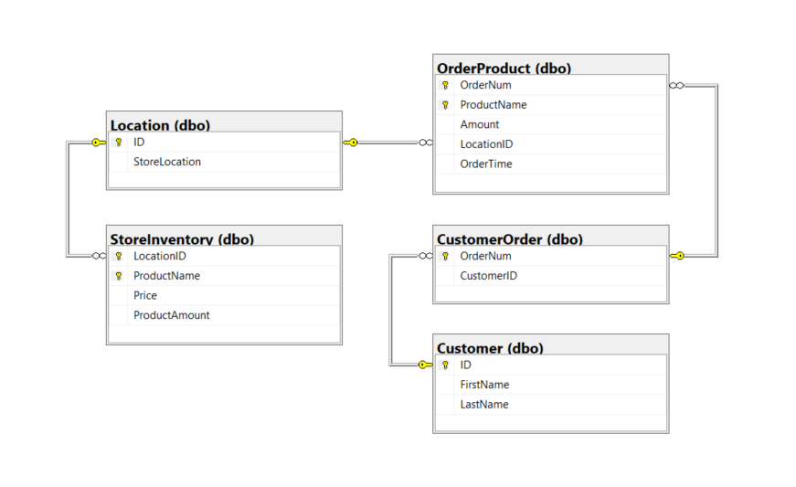
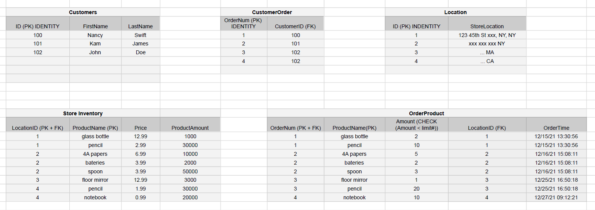

# Store Inventory Manager

## Project Description
This application is designed for use by a retail store employee to record incoming orders of different products. The logic and data are managed in a RESTful HTTP service, while the user interface is a console application. The user can examine customer information, searchable by name, and examine the sortable order history, including orders to specific locations and by specific customers. Orders are validated and store inventory is tracked as orders are fulfilled or rejected.

## Technologies Used
### Frameworks:
* .NET Core
* ASP.NET Core

### Programming Languages:
* C#
* SQL

### Database:
* Azure SQL Server

### Database Connection:
* ADO.NET

### Web Service API:
* REST API

### Service Hosting:
* Azure App Service

### Testing:
* xUnit Test

### Platforms:
* Azure
* Docker Desktio
* Docker Hub
* GitHub
* Visual Studio
* SonarCloud

### My Database Diagram:

### My Database Outline:

## Features
* Create new account
* Login to Store App
* Select shopping location
* Select items from the store location
* Place an order
* View order history. Options are as follows:
  * Display order history from specific store location
  * Display order history from all store location
  * Display order history of a specific order number
  * Display order history of most recent order
* Exit the store location/Back to menu options

## Getting Started
> git clone https://github.com/211115-UTA-NET/JingZ-P1.git
> 
